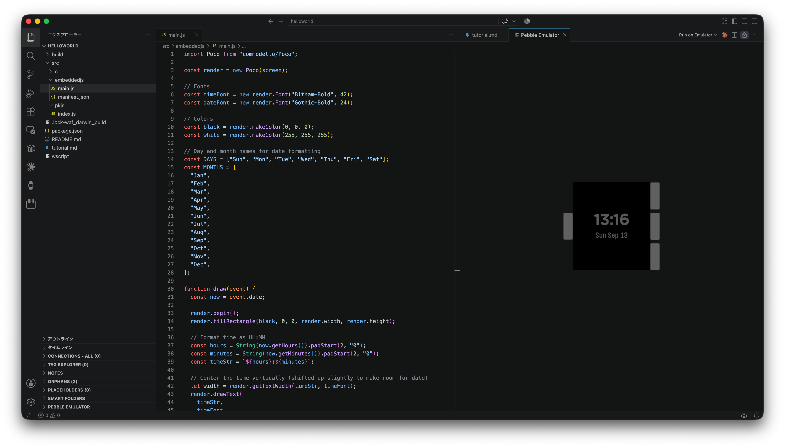
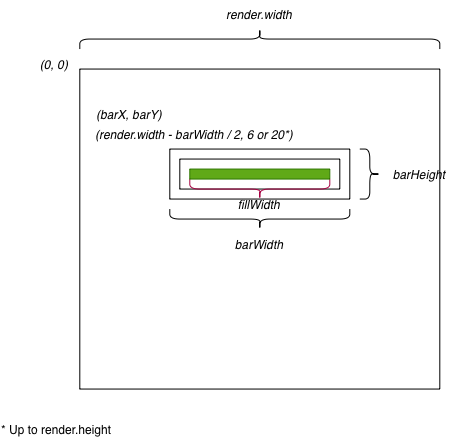
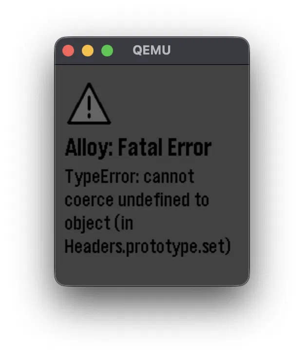
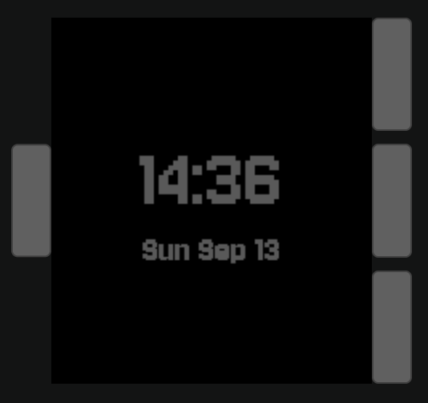
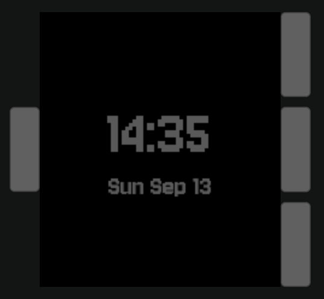

# Tutorial

## Environment

- M4 MacBook Air
- macOS Tahohe 26.6.2（25G83）
- Homebrew 6.0.22
- VS Code 1.137.0
- Python 3.14.7
- node v26.8.2

## Install Pebble SDK

Find more information at [INSTALLING THE PEBBLE SDK](https://developer.repebble.com/sdk/).

## Install VS Code plugin

You can download it at [Official Market Place](https://marketplace.visualstudio.com/items?itemName=coredevices.pebble-vscode).

## Create first project using VS Code

1. Run `>pebble: New Project` with Command + Shift + P.
2. Choose `Alloy`.
3. Enter `helloworld`.
4. Select a directory for the first project.

## Directory Structure

- `embeddedjs/` - For Pebble Smartwatch.
- `pkjs/` - For Pebble Companion Application that runs on the smartphone.

## Enjoy your tutorial

You can download a base source code from [coredevices/alloy-watchface-tutorial](https://github.com/coredevices/alloy-watchface-tutorial/tree/main/part1).

Based on this source code, you can proceed the tutorial "[Your First Watchface](https://developer.repebble.com/tutorials/alloy-watchface-tutorial/part1/)."



## Part 3 - Size Calculation



## Part 4 - Install Pebble Dependency

```shell
helloworld % pebble package install @moddable/pebbleproxy
```

## Part 4 - Order of HTTP Request via Pebble Companion App

1. **Pebble**: Call `fetch()`. This request will be routing to Phone via Bluetooth.
2. **Pebble Companion App(Phone)**: Fire `moddableProxy.appMessageReceived()`. Actuall request to HTTP server will be sent at this time.
3. **HTTP Server**: Receive a request and response to origin.
4. **Pebble Companion App(Phone)**: Send response to Pebble as AppMessage via Bluetooth.
5. **Pebble**: Receive response from Phone.

## Part 5 - Timeline Quick View on Emulator (Qemu)

When you launch emulator in Visual Studio Code, you cannot use Timeline Quick View properly. If you do so, the emulation will be failed.



> Alloy: Fatal Error
>
> Type Error: cannot coerce undefined to object (in Headers.prototype.set)

````shell
# Build & Install & Launch Emulator
helloworld % pebble build && pebble install --emulator emery

# Enable Timeline Quick View
helloworld % pebble emu-set-timeline-quick-view on

# (Optional) Disable Timeline Quick View
helloworld % pebble emu-set-timeline-quick-view off
```

## Question 1: `watchface` or `watchapp`

In `package.json`, it is defined as follows:

```json
    ...
    "watchapp": {
      "watchface": true
    },
    ...
````

When you set `watchface` as `true`, the app is watch face. When `false`, it is watch app.

## Question 2: Difference between monochromed or not

`monochrome` is `true`:



`monochrome` is `false`:



# Resources

- [スマートウォッチPebbleのアプリがJavaScriptで作成できるようになりました (by stc)](https://zenn.dev/stc1988/articles/e022df8cc51023)
- [Your First Watchface](https://developer.repebble.com/tutorials/alloy-watchface-tutorial/part1/)
